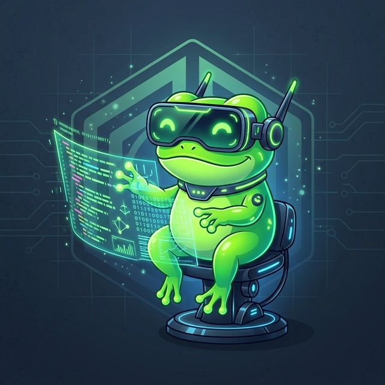
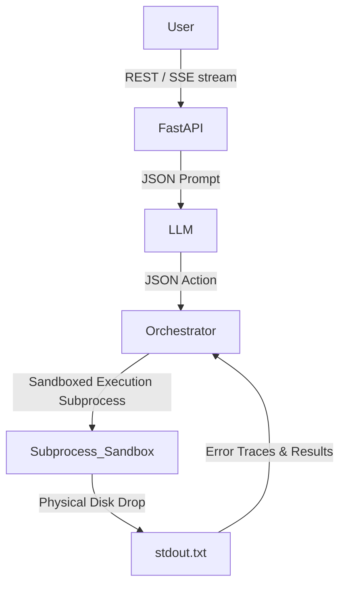

<div align="center">
  
  
  <br/>
  
  
  
  
  
  
</div>

# Frog AI V2 - The Autonomous Desktop Agent

Frog AI is a deeply autonomous, cross-platform personal AI agent. It acts as a **desktop-native expert** that doesn't just answer questions, but actively **plans, executes, remembers, and self-evolves**.

V2 introduces a complete **IDE-style vertical split UI**, a **Pipeless Subprocess Sandbox**, and **Autonomous Tool Generation**, bridging the gap between a developer API and a consumer-ready AI Operating System.

---

## ✨ What's New in V2?

1. **IDE-Style Interface**: Frog now features a professional, highly productive layout mirroring VS Code. It separates the Chat/Markdown Editor from the real-time execution `Console`, letting you watch the AI compile macros and execute code live.
2. **First-Boot Setup Wizard**: A sleek frosted-glass wizard dynamically sets up your proxy, API limits, and injects industry-specific Personas into your local `project_memory.json`.
3. **Pipeless Process Isolation Sandbox**: The holy grail of agent architectures. AI-generated Python plugins now execute in a completely isolated, pipeless subprocess (`stdout.txt` physical drop) with a strict 30-second thermal timeout, eliminating UI freezing and ghost-process deadlocks on Windows/macOS.
4. **Native Document Generation**: Equipped with a core `document_generator` plugin, Frog bypasses writing messy intermediary scripts and natively outputs rich `.pptx` and `.docx` directly to your desktop.

---

## 🚀 Core Capabilities

- **True Autonomy (ReAct Engine):** Frog writes its own steps, evaluates tool outputs, and automatically retries with corrected logic if a tool fails (Self-Healing).
- **Proactive Intelligence:** Features a background curiosity loop, daily persona generation based on chat history, and long-term generic goal tracking.
- **Dynamic Skill Evolution (`plugin_generator`):** Adding new skills is natively supported. If Frog lacks a capability, it will use its `plugin_generator` to write a cross-platform Python script, compile it into a `manifest.json`, and permanently install it as a new "Macro Skill" in `generated_tools/`.
- **System-level Integration:** Native Windows/macOS/Linux toast notifications (`notify_user`) and shell execution (`shell_executor`) built-in.
- **Secure File Manipulator:** Able to traverse directories, read logs (using `fs_expert`), and automatically format massive batches of data.

---

## 🛠️ Environment Requirements

- **OS:** Windows 10/11, macOS, Linux (Cross-platform)
- **Node.js:** v18.0 or higher
- **Python:** v3.10 or higher (Dependencies: `fastapi`, `uvicorn`, `python-pptx`, `python-docx`, `pypdf`, `duckduckgo-search`, etc.)
- **LLM Account:** Any OpenAI-compatible API key (OpenAI, Anthropic, DeepSeek, local LM Studio, etc.) or Google Gemini API.

---

## 📦 Installation

To get started, clone the repository to your local machine:
```bash
git clone https://github.com/jinlongbao/frog-ai.git
cd frog-ai
```

---


## 🏃 Build & Run

Frog AI is cross-platform. Click the button below for your specific operating system to see the setup instructions:

<details>
<summary>🪟 <strong>Windows</strong> (Click to expand)</summary>
<br>

**1. Initialize Python Backend**
```cmd
cd frog-core
pip install -r requirements.txt
```
*(Note: If you plan to use OCR capabilities on scanned PDFs, please ensure `tesseract` or `poppler` are installed natively in your OS PATH).*

**2. Initialize Node.js Frontend**
```cmd
cd ..\frog-shell
npm install
```
> **Troubleshooting**: If you are using **PowerShell** and encounter an Execution Policy error (`cannot be loaded because running scripts is disabled`), try running `npm.cmd install` instead, or run this command as Administrator first: `Set-ExecutionPolicy RemoteSigned -Scope CurrentUser`.

**3. Start the Application**
```cmd
cd ..
python start_frog.py
```
</details>

<details>
<summary>🍎 <strong>macOS</strong> (Click to expand)</summary>
<br>

**1. Initialize Python Backend**
```bash
cd frog-core
pip3 install -r requirements.txt
```
*(Note: For OCR on macOS, install poppler and tesseract via Homebrew: `brew install poppler tesseract`).*

**2. Initialize Node.js Frontend**
```bash
cd ../frog-shell
npm install
```

**3. Start the Application**
```bash
cd ..
python3 start_frog.py
```
</details>

<details>
<summary>🐧 <strong>Linux (Ubuntu/Debian)</strong> (Click to expand)</summary>
<br>

**1. Initialize Python Backend**
Make sure you have python3-venv and build-essential installed.
```bash
sudo apt update && sudo apt install python3-pip poppler-utils tesseract-ocr
cd frog-core
pip3 install -r requirements.txt
```

**2. Initialize Node.js Frontend**
```bash
cd ../frog-shell
npm install
```

**3. Start the Application**
```bash
cd ..
python3 start_frog.py
```
</details>

---

*(Alternatively for all systems, you can manually run `uvicorn main:app --port 8000` in `frog-core` and `npm start` in `frog-shell` in two separate terminal windows).*


---

## 🔌 High-Performance Architecture

Frog separates its cognitive reasoning (FastAPI Backend) from its display layer (Electron). 
When the LLM generates a tool call, `tool_writer.py` catches it and provisions an isolated context memory block:



---

## 🧩 External Plugin Specification

Plugins allow Frog to interact with the real world. Frog dynamically loads all built-in plugins from `frog-core/plugins/` and AI-generated skills from `frog-core/generated_tools/`.

A plugin requires exactly 2 files:
1. `manifest.json` (Describes the tool to the LLM)
2. `index.py` (The actual execution logic)

### `manifest.json` Example
```json
{
  "id": "my_custom_tool",
  "name": "My Custom Tool",
  "description": "Does something amazing.",
  "version": "1.0.0",
  "entry": "index.py",
  "parameters": {
    "type": "object",
    "properties": {
      "target": { "type": "string", "description": "The target to process." }
    },
    "required": ["target"]
  }
}
```

### `index.py` Example
*Code must be cross-platform (use `os.path` and `platform.system()`).*
```python
def execute(params: dict, context: dict) -> dict:
    target = params.get("target")
    try:
        # Do work...
        return {"status": "success", "result": f"Processed {target}"}
    except Exception as e:
        return {"status": "error", "message": str(e)}
```

---

## 🏭 Industry Templates
Frog ships with sample JSON templates in `templates/` (e.g., `coder.json`, `researcher.json`). 
You can load these natively inside the Setup Wizard to instantly reconfigure Frog's persona, operational goals, and code-cleanliness habits for specific specialized jobs!

---

## ⚖️ License

This project is open-source and released under the [MIT License](LICENSE). 
You are free to use, modify, and distribute this software, as long as the original copyright notice is provided.
