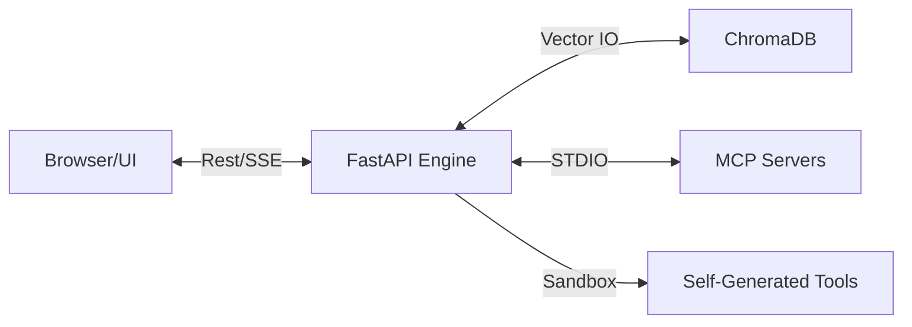

<div align="center">
  
  
  <h3>Frog AI v3.0: The Universal MCP Agent</h3>

  <p>
    
    
    
  </p>
</div>

---

## 🌟 Overview
**Frog AI** is a professional-grade, autonomous AI agent ecosystem built for one-command deployment. It transcends simple chat interfaces by providing a standardized **Model Context Protocol (MCP)** bridge, allowing the AI to seamlessly connect with external services like GitHub, Slack, SQLite, and Google Drive.

The **v3.0 "Web-First" Architecture** decouples the engine from the UI, enabling Frog to run inside a unified Docker stack while being accessible from any modern web browser or its native Electron wrapper.

---

## 🔥 Key Features

- **🚀 One-Command Deployment**: Fully containerized with `docker-compose`. No complex Python dependency hell.
- **🔌 MCP Native Integration**: Discover and connect to any community MCP server. The AI sees, reads, and interacts with external service contexts.
- **🧠 Hybrid Vector Memory**: Powered by ChromaDB, Frog maintains long-term project memory and industry-specific expert knowledge.
- **🛠️ Self-Evolving Tools**: If the AI doesn't have a tool, it writes a new Python script, validates it in a sandbox, and installs it permanently.
- **🌐 Dual-Mode UI**: Professional IDEA-style web interface accessible via `localhost:8080` or as a localized Desktop application.

---

## 🏗️ Architecture



---

## 🚀 Quick Start

### 1. Prerequisites
- **Docker & Docker Compose**
- **Git**
- **LLM API Key** (OpenAI compatible)

### 2. Startup (The One-Command Way)
```bash
# 1. Clone & Enter
git clone https://github.com/jinlongbao/frog-ai.git && cd frog-ai

# 2. Config Environment
cp .env.example .env
# Edit .env and add your OPENAI_API_KEY

# 3. Launch the Stack
docker compose up -d --build
```

### 3. Access
- **Web UI**: [http://localhost:8080](http://localhost:8080)
- **Backend API**: [http://localhost:8000/docs](http://localhost:8000/docs)

---

## 📚 Documentation
For detailed guides on plugin development, MCP configuration, and industry persona templates, please refer to our Wikis:
- 📖 [English Wiki Guide](docs/WIKI_EN.md)
- 📖 [中文维基指南](docs/WIKI_ZH.md)

---

## ⚖️ License
Released under the [MIT License](LICENSE).
